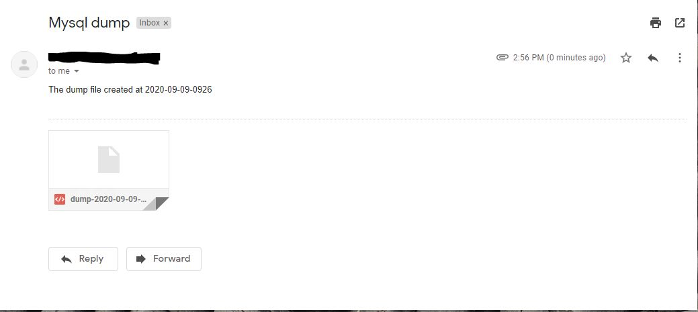

## Overview

1) Backup Mysql Database and Send mail through Python email. 
2) Backup should run every day at 12 clocks by cron jobs.

---

## Setup the Enviroment

* Environment used is centos7.
* Python-3.7.4
* MYSQL 5.7

### Script to install Python for centos 7:

* `sh python37-install.sh`

### Install Python for others:

* Python3.7 - [https://www.python.org/downloads/release/python-374/](https://www.python.org/downloads/release/python-374/)

### Script to install mysql for centos 7:

* `sh mysql57_install.sh`

### Mail Information:

Edit send_mail.py for Email information.
* In email['from'] - Write sender's name
* In email['to'] - Receiver email 
* In smtp.login - Add sender's mail and password

### Database Information:

Edit mysql_dump.sh
* DBUSER
* DBPASSWORD
* DBNAME
* FILELOCATION - Added the file location to create dumpfiles.

## Setup Gmail: 

* Enable less secure apps Permission in gmail - [https://myaccount.google.com/lesssecureapps](https://myaccount.google.com/lesssecureapps)
* Still problem in sending mail, then try clearing Captcha - [https://accounts.google.com/DisplayUnlockCaptcha ](https://accounts.google.com/DisplayUnlockCaptcha )
  
## Use cron job to automate Backup

* `crontab -e`
* `0 12 * * * sh /home/centos/mysqldump-to-mail-using-python-email/mysql_dump.sh`

## To Run

* `sh mysql_dump`

## Output Mail:

